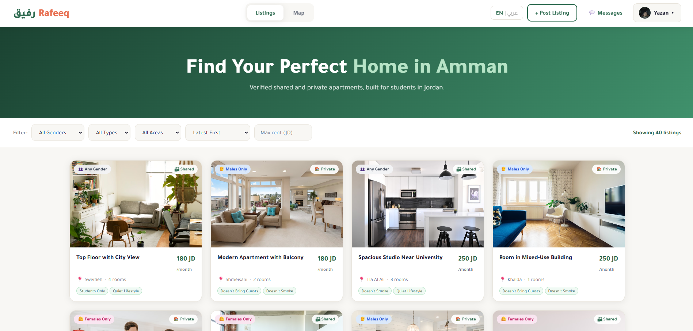
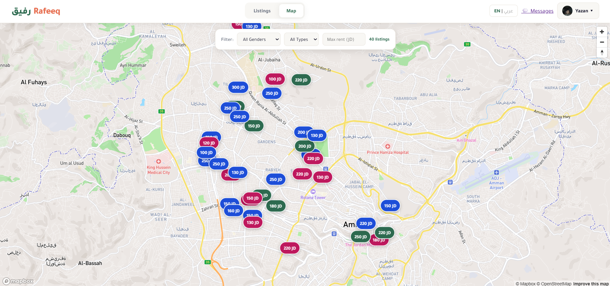
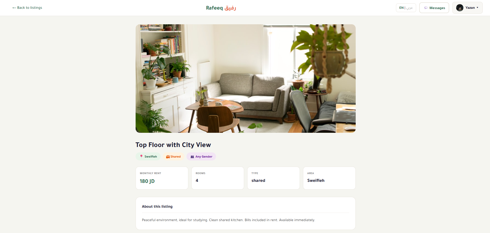
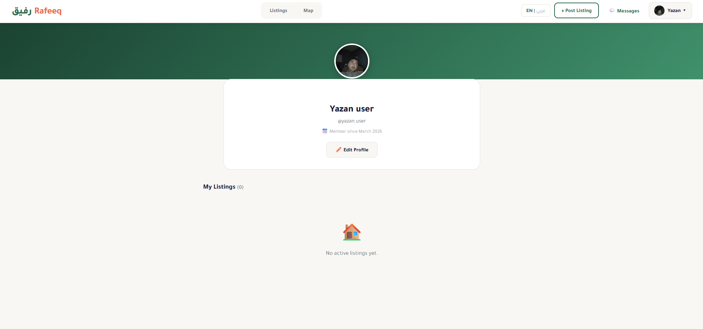
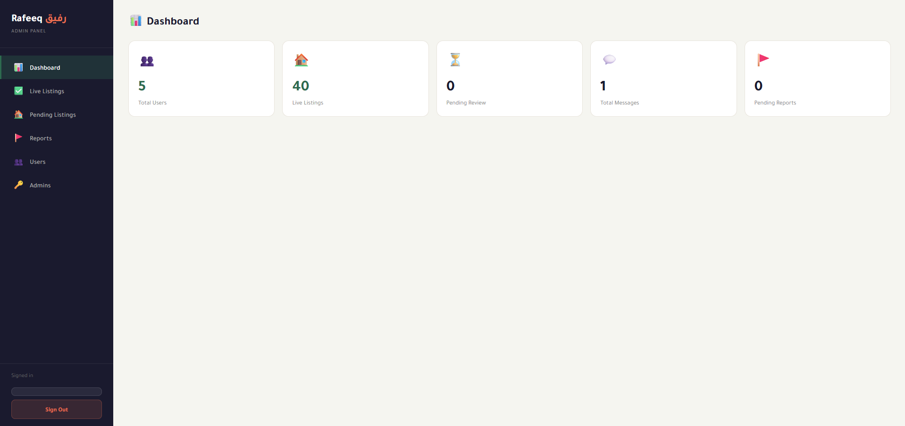

# رفيق Rafeeq — Student Housing Platform

> **Your companion in finding a home.**  
> A map-based, verified roommate matching platform built specifically for students in Amman, Jordan.

🔗 **Live Demo:** https://rafeeq-production.up.railway.app

---

## 📸 Screenshots

### Homepage


### Map View


### Listing Detail


### User Profile


### Admin Dashboard


---

## 🧩 The Problem

Students in Jordan find roommates through chaotic Facebook groups with no filtering, no trust system, and no structure. Rafeeq solves this with a verified, map-based platform designed specifically for Amman.

---

## ✨ Features

### For Users
- 🗺 **Map-based listings** — browse apartments as pins on an interactive Mapbox map
- 🔍 **Smart filters** — filter by gender preference, apartment type, area, and price
- 💬 **Real-time messaging** — chat with listing owners via SocketIO without leaving the platform
- 👤 **User profiles** — public profile pages showing listings and posting insights
- 📊 **Posting insights** — listers see total views and messages received per listing
- 🪪 **Verified listings** — every listing requires a National ID upload before going live
- 📷 **Photo galleries** — upload up to 10 apartment photos per listing
- ⚙️ **Account settings** — update name, phone number, and profile picture
- 🌐 **Arabic / English toggle** — full bilingual support with RTL layout

### For Admins
- ✅ **Listing approval flow** — review National ID and approve or reject listings
- 🗑 **Live listings management** — view, filter by date, and delete live listings
- 🚩 **User reports** — review and resolve reports submitted by users
- 👥 **User management** — view all registered users
- 📄 **PDF & Excel exports** — export reports and user data

---

## 🛠 Tech Stack

| Layer | Technology |
|---|---|
| Backend | Python 3.11 + Flask |
| Database | PostgreSQL (Supabase) |
| Real-time | Flask-SocketIO + Eventlet |
| Maps | Mapbox GL JS |
| Frontend | HTML + CSS + Vanilla JS |
| Auth | Flask Sessions + Werkzeug password hashing |
| Security | Flask-Limiter, Bleach sanitization |
| Deployment | Railway |
| PWA | Service Worker + Web Manifest |

---

## 🗄 Database Schema

The platform uses 8 interconnected tables:

| Table | Purpose |
|---|---|
| `users` | Registered users with gender enforcement |
| `listings` | Apartment posts with approval status and view counter |
| `listing_tags` | Lifestyle tags per listing (normalized) |
| `listing_photos` | Multiple photos per listing (stored as base64) |
| `messages` | Full in-platform chat history |
| `admins` | Admin accounts, separate from regular users |
| `reports` | User-submitted reports about listings |
| `ratings` | User ratings system |

---

## 🚀 Running Locally

### Prerequisites
- Python 3.11+
- pip

### Setup

```bash
# Clone the repo
git clone https://github.com/yazanawwad61/rafeeq.git
cd rafeeq

# Install dependencies
pip install -r requirements.txt

# Run the app
python app.py
```

The app will start at `http://localhost:5000` using SQLite locally.

### Environment Variables (for production)

| Variable | Description |
|---|---|
| `SECRET_KEY` | Flask secret key |
| `DATABASE_URL` | PostgreSQL connection string |
| `MAPBOX_TOKEN` | Mapbox public token |
| `MAIL_PASSWORD` | Gmail app password |

---

## 📁 Project Structure

```
rafeeq/
├── app.py                  # Main Flask application
├── database.py             # Database initialization script
├── requirements.txt
├── static/
│   ├── lang.js             # Arabic/English translation engine
│   ├── sw.js               # Service worker (PWA)
│   ├── manifest.json       # PWA manifest
│   └── icons/              # PWA icons
└── templates/
    ├── index.html          # Homepage with listing grid
    ├── map.html            # Full-screen map view
    ├── listing.html        # Listing detail page
    ├── profile.html        # User profile page
    ├── my_listings.html    # Manage own listings
    ├── messages.html       # Messaging inbox
    ├── admin_login.html    # Admin login
    └── admin_dashboard.html # Admin panel
```

---

## 🔐 Key Design Decisions

- **Gender separation** enforced at the database level — male and female listings never appear to the wrong audience
- **Listing approval flow** — listings start as `pending` and only go live after an admin reviews the poster's National ID
- **Database normalization** — tags and photos stored in separate tables for easy filtering and scaling
- **No filesystem dependency** — all uploaded images stored as base64 in the database, making the app fully compatible with ephemeral hosting platforms like Railway
- **Bilingual from day one** — a shared `lang.js` translation engine powers Arabic/English switching across all pages with full RTL support

---

## 📌 Roadmap

- [ ] Email verification via Resend (pending custom domain)
- [ ] Arabic listing titles and descriptions
- [ ] Saved/favorited listings
- [ ] Apartment ratings after move-in

---

## 👨‍💻 Author

**Yazan Awwad** — MIS Graduate, University of Jordan  
Building projects that solve real problems.

[](https://github.com/yazanawwad61)

---

*Built stage by stage, documented along the way.*
